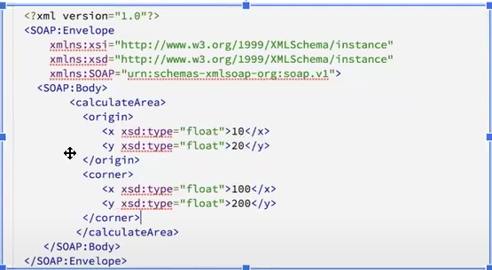
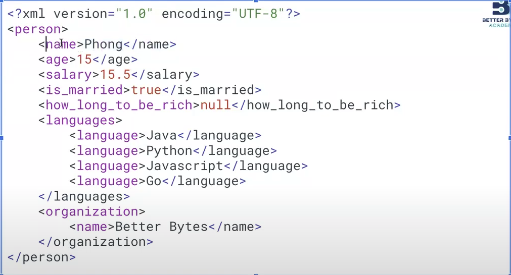
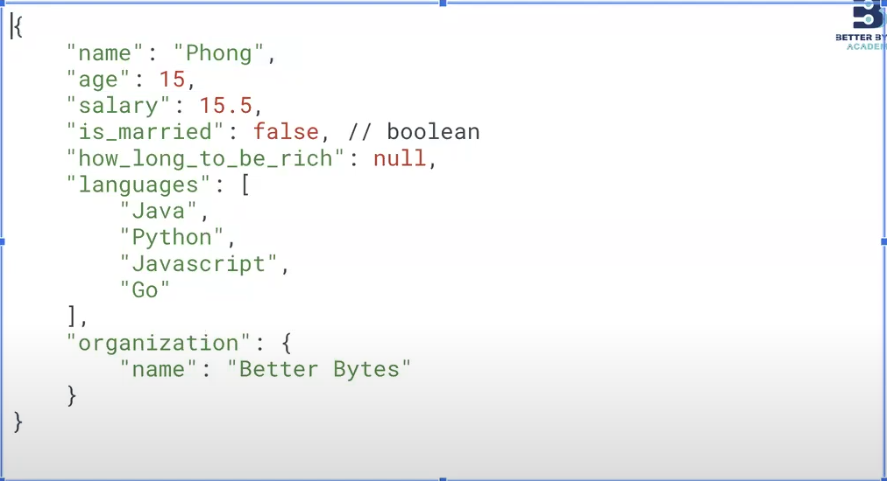
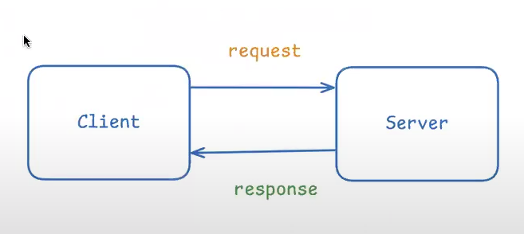
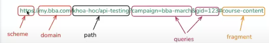

## API (Application Programming Interface)
- Một bộ quy tắc giúp các phần mềm giao tiếp với nhau
- Cần test API vì
    - Đảm bảo dữ liệu hoạt đống đúng: Nếu API không trả về đúng kết quả hoặc gây lỗi sẽ ảnh hưởng đến hệ thống
    - Phát hiện lỗi sớm: Có thể phát hiển lỗi sớm trước khi 1 tính năng nào đó được triển khai
    - Đảm bảo hiệu năng
    - Bảo mật: Có thể dùng API để truyền tham số (invalid - SQL injection,..) để check xem được BE có validate chưa

### Các hình thức test API phổ biến
1. Functional Tesing: Kiểm thử chức năng của API hoạt động đúng mong đợi
2. Load Testing: Kiểm thử hiệu suất của API
3. Security Testing: Kiểm thử bảo mật
4. Intergration Testing: Kiểm thử tích hợp, đảm bảo API hoạt động đúng khi tích hợp với hệ thống khác
### Các loại API phổ biển
**1. Web APIs (REST, SOAP, GraphQL)**

- REST API: sử dụng phương thức HTTP (GET, POST, PUT, DELETE)

- SOAP: Giao tiếp sử dụng XML
    

- GraphQL: Ngôn ngữ do Facebook phát triển, cấu trúc querry phản ánh cấu trúc data trả về

**2. Library/Framework APIs**
- Cho phép sử dụng những chức năng có sẵn

**3. Operating System APIs**
- Những API tương tác với hệ điều hành

**4. Hardware APIs**
- Giao tiếp phần mềm với phần cứng

### Các công cụ test API phổ biến

- Công cụ hỗ trợ test API manual
    - cURL
    - Postman
    - IntelliJ IDE
    - Jmeter
    - SOAP UI
- Công cụ hỗ trợ test API automation
    - Playwright
    - RestAssured
    - Cypress
    - Karate
    - Katalon
    - Selenium
    - Webdriver IO

### XML(eXtensible Markup Language)
- Là một "ngôn ngữ đánh dấu", "tự giải thích"

- Chuẩn được W3 gợi ý dùng

### JSON(JavaScript Object Notation)
- Là định dạng text, dùng format object của js
- Dùng để truyền dữ liệu, nhẹ hơn xml
- Không phụ thuộc vào ngôn ngữ lập trình
- Có kiểu: key - value

## REST API
- Là một mô hình Client(gửi request) và Server(trả về response)

||Thành phần|
|-|-|
|**request** |**1. Method**: Là phương thức định nghĩa trong giao thức HTTP để chỉ ra hành động mà client muốn thực hiện với tài nguyên server   &emsp;- GET: Lấy dữ liệu   &emsp;- POST: Tạo mới dữ liệu   &emsp;- PUT: Cập nhật toàn bộ dữ liệu   &emsp;- PATCH: Cập nhật một phần dữ liệu   &emsp;- DELETE: Xóa dữ liệu   &emsp;- HEAD: Lấy metadata của resource   &emsp;- OPTIONS: Lấy thông tin về methods   **2. URL**: Là đường dẫn tới resource   &emsp;   **3. Header**: Là dữ liệu đầu trong mỗi request, là cặp ket-value để truyền tải thông tin bổ sung giữa client và server    &emsp; - Authentication Header: Xác thực  &emsp; - Content Header: Khai báo kiểu dữ liệu gửi lên server  &emsp; - Caching Header: Liên quan đến bộ nhớ đệm (cache)  &emsp; - Security Header  &emsp; - CORS Header: Chia sẽ dữ liệu giữa các domain khác nhau  **4. Body**: Phần dữ liệu được gửi trong 1 request (Thường có dạng JSON, XML hoặc Form-Data)|
|**response** |**1. Status code**: Hiểu được kết quả của request gửi đến server, là 1 số gồm 3 chữ số được chia thành 5 nhóm chính:   &emsp; - 1xx - Informational: Nhóm thông tin, cho biết request đã được server tiếp nhận và xử lý   &emsp; - 2xx - Success: Cho biết request đã được xử lý thành công   &emsp; - 3xx - Redireciton: Cho biết client cần thực hiện thêm hành động để hoàn tất request   &emsp; - 4xx - Client error: Lỗi từ phía client   &emsp; - 5xx - Server error: Lỗi từ phía server   **2. Header**   **3. Body**|
